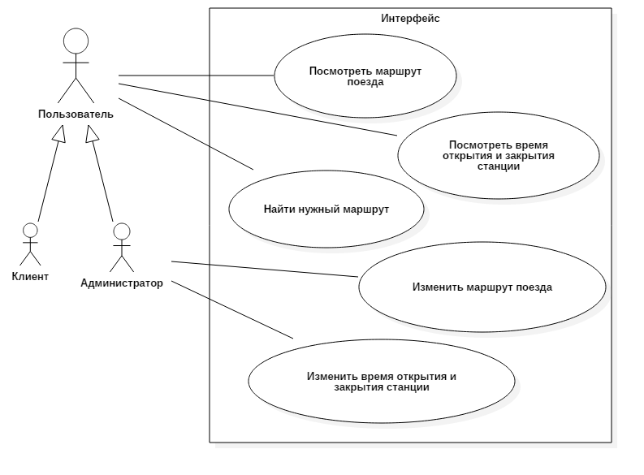
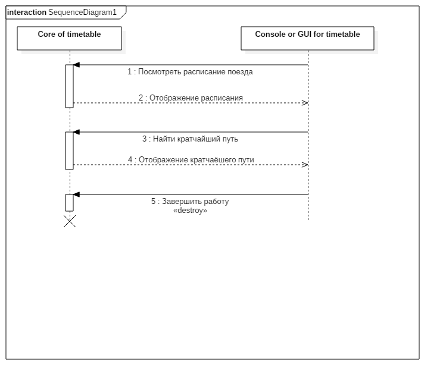
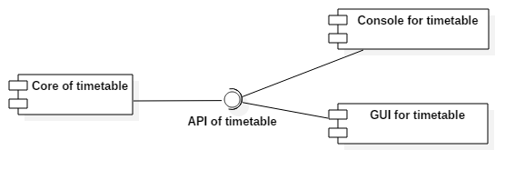

# Транспортное расписание

## Задание

Реализовать проект "Транспортное расписание" 

"Транспортное расписание" - программа позволяющая создать, редактировать и использовать расписание для поездов метрополитена

## Концепция (vision statement)

Программа должна предоставлять обычному пользователю возможность просмотра маршрута поездов, показывать время начала и окончания работы станций и помочь найти способ проезда до нужной станции. У администратора в отличие от обычного пользователя должны присутствовать права на редактирования данных. 

## Минимально работоспособный продукт (Minimum viable product)

Программа, которая позволяет обычному пользователю просмотерть маршруты поездов, время начала и окончания работы станций, а администратору редактировать эту информацию

## Диаграмма прецедентов использования

## Диаграмма последовательностей

## Диаграмма компонентов

