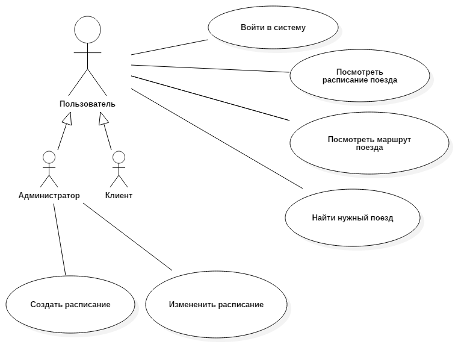
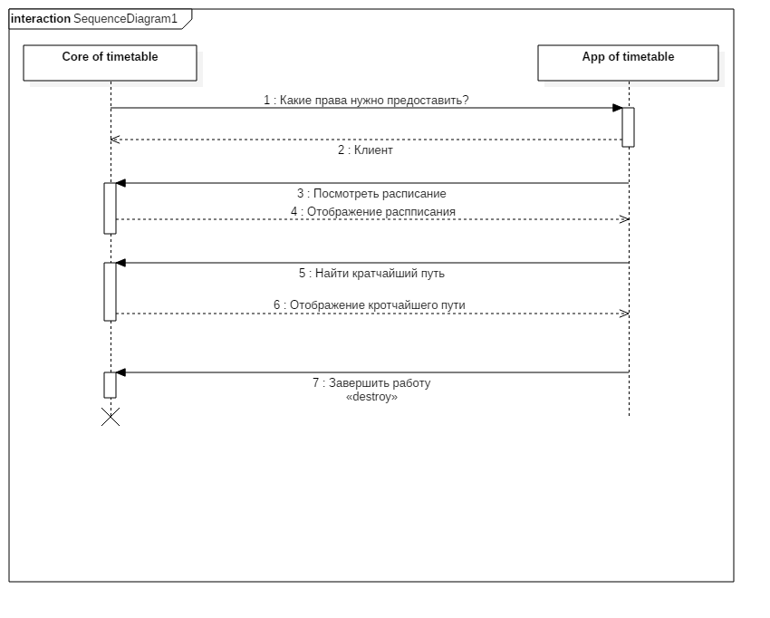
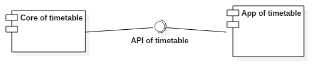

# Транспортное расписание

## Задание

Реализовать проект "Транспортное расписание" 

Программа должна предоставлять пользователю возможность просмотреть расписание поездов, их маршрут(станции через которые проходит поезд) и помочь найти способ проезда, а администратору право на создание/изменение расписания

## Концепция (vision statement)

Программа позволяющая посмотерть расписание поездов, их маршрут и найти способ проезда до нужной станции, а при переходе в режим администратора изменять расписания или создавать новые будет считаться конечным продуктом. Кроме того объязательно должна присутствовать справка по функциям предоставляемых программой.

## Минимально работоспособный продукт (Minimum viable product)
https://en.wikipedia.org/wiki/Minimum_viable_product

## Диаграмма прецедентов использования

## Диаграмма последовательностей

## Диаграмма компонентов

